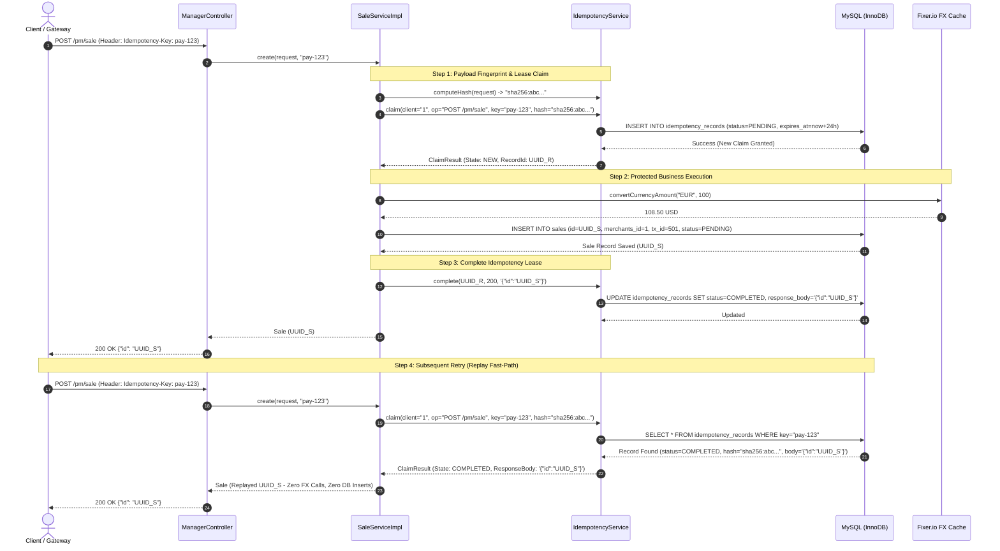

# Architecture Decision Record (ADR): Microservices Idempotency Strategy

**Document ID:** `ADR-002`  
**Status:** `ACCEPTED / IMPLEMENTED`  
**Date:** 2026-08-19  
**Context:** Distributed Payment Processing & Deduplication Engine  
**References:**
* [Building Idempotent Microservices in Spring Boot (Farah Deeva)](https://javascript.plainenglish.io/building-idempotent-microservices-in-spring-boot-the-secret-ingredient-for-exactly-once-07472d4a240c)
* [Implementing Idempotency in Distributed Spring Boot Apps Using MySQL (Balakumaran Sugumar)](https://dzone.com/articles/implementing-idempotency-spring-boot-mysql)
* [Idempotency Keys in Spring Boot APIs (Alexander Obregon)](https://alexanderobregon.substack.com/p/idempotency-keys-in-spring-boot-apis)
* [Spring Boot REST API Idempotency-Key Guide (Mizucoffee)](https://springboot-123.mizucoffee.com/en/blog/spring-boot-rest-api-idempotency-key-guide/#q-should-i-attach-idempotency-key-to-get-as-well)

---

## Executive Summary & Scope Overview

In distributed payment systems, network retries, client timeouts, and concurrent webhooks routinely cause duplicate requests. Achieving "exactly-once" business semantics requires application-level idempotency backed by durable database invariants.

This system implements an **industry-standard, dedicated `IdempotencyRecord` engine** that intercepts requests before downstream external calls (such as currency conversion via Fixer.io or merchant validation), validates payload fingerprints with SHA-256, handles concurrent in-flight race conditions, manages response caching & replay, and safely cleans up expired records.

In addition, the domain `sales` table retains its `(merchants_id, transaction_id)` unique constraint as a **defense-in-depth business invariant**.

```
+--------------------------------------------------------------------------------------------------+
|                                    SCOPE AT A GLANCE                                             |
|                                                                                                  |
|   ACTIVE IMPLEMENTATION (INCLUDED)            FUTURE ROADMAP (DISTRIBUTED SCALE)                 |
|   --------------------------------            ----------------------------------                 |
|   ✓ Dedicated IdempotencyRecord Entity & Table → Redis Distributed Fast-Locking (SETNX + TTL)   |
|   ✓ Multi-Tenant 3D Scoping (Client+Op+Key)    → Reusable Spring AOP @Idempotent Aspect          |
|   ✓ Standard "Idempotency-Key" Header + Fallback→ Transactional Outbox Pattern                   |
|   ✓ SHA-256 Payload Fingerprinting (422)       → Kafka Event Stream Consumer Deduplication       |
|   ✓ In-Flight State Tracking (409 Conflict)                                                      |
|   ✓ Response Caching & Fast Replay (200 OK)                                                      |
|   ✓ Failure State Recovery (FAILED -> PENDING)                                                   |
|   ✓ State-Safe Scheduled Retention Purge Worker                                                  |
|   ✓ Domain Invariant Defense-in-Depth (Sales UK)                                                 |
|   ✓ Comprehensive Multi-Threaded Test Suite                                                      |
+--------------------------------------------------------------------------------------------------+
```

---

## 1. Architecture Flow: Dedicated `IdempotencyRecord` Engine

```mermaid
flowchart TD
    Client[Client / Gateway] -->|POST /pm/sale + Optional Idempotency-Key| Ctrl[ManagerController]
    Ctrl -->|create request| Service[SaleServiceImpl]
    
    subgraph "Idempotency Subsystem"
        Service -->|1. Compute SHA-256 Fingerprint| Hash[Payload Hash: sha256:...]
        Hash -->|2. Claim Lease| ClaimSvc[IdempotencyServiceImpl.claim]
        ClaimSvc -->|Optimistic INSERT / Query| IdempDB[(Table: idempotency_records)]
        
        IdempDB -- Status: COMPLETED (Hash Matches) --> Replay[Fast Replay: Return Cached JSON (200 OK)]
        IdempDB -- Status: COMPLETED (Hash Differs) --> Mismatch422[Throw 422 Unprocessable Entity]
        IdempDB -- Status: PENDING (Hash Differs) --> Mismatch422
        IdempDB -- Status: PENDING (Hash Matches) --> InFlight409[Poll / Throw 409 Conflict + Retry-After]
        IdempDB -- Status: FAILED --> GrantRetry[Reset to PENDING, Allow Retry]
        IdempDB -- New Claim Created (PENDING) --> Proceed[Proceed to Execution]
    end
    
    Proceed -->|3. Validate Merchant| MerchantSvc[Merchant Service]
    Proceed -->|4. Convert FX| Fixer[Fixer.io 30s Cache]
    Fixer -->|5. Save Entity| SalesDB[(Table: sales - Domain Unique Invariant)]
    
    SalesDB -- Save Success --> MarkComplete[IdempotencyService.complete: Status COMPLETED + Cache JSON]
    SalesDB -- Error / Exception --> MarkFail[IdempotencyService.fail: Status FAILED]
    
    Replay --> Ctrl
    MarkComplete --> Ctrl
    InFlight409 --> Ctrl
    Mismatch422 --> Ctrl
```

---

## 2. Core Architectural Decisions

### Decision 1: Dedicated `IdempotencyRecord` Persistence Table
* **Decision:** Idempotency tracking is decoupled from domain business entities and managed in a dedicated database table (`idempotency_records`).
* **Rationale:** Domain tables (like `sales`) should only represent persisted business resources. An explicit idempotency table allows tracking in-flight execution leases, payload fingerprints, failure retries, and cached responses across *any* endpoint or operation without mutating domain schemas.
* **Schema Definition:**
  ```sql
  CREATE TABLE idempotency_records (
      id BINARY(16) NOT NULL,
      client_id VARCHAR(64) NOT NULL,
      operation_name VARCHAR(128) NOT NULL,
      idempotency_key VARCHAR(128) NOT NULL,
      request_hash VARCHAR(71) NOT NULL,
      status ENUM('PENDING','COMPLETED','FAILED') NOT NULL DEFAULT 'PENDING',
      response_status INT NULL,
      response_body LONGTEXT NULL,
      created_at DATETIME NOT NULL DEFAULT CURRENT_TIMESTAMP,
      expires_at DATETIME NOT NULL,
      PRIMARY KEY (id),
      UNIQUE INDEX uk_idempotency_client_op_key (client_id, operation_name, idempotency_key),
      INDEX idx_idempotency_expires (expires_at, status)
  ) ENGINE=InnoDB;
  ```

### Decision 2: Multi-Tenant 3D Key Scoping
* **Decision:** Idempotency uniqueness is scoped across three dimensions: `(client_id, operation_name, idempotency_key)`.
* **Rationale:** Guarantees tenant isolation (Client 1 using UUID `A` never collides with Client 2 using UUID `A`) and endpoint isolation (Client 1 using UUID `A` for `POST /pm/sale` never collides with `POST /pm/refund`).

### Decision 3: Standard HTTP `Idempotency-Key` Header with Deterministic Fallback
* **Decision:** Support the industry-standard `Idempotency-Key: <UUID>` header. If the header is omitted by legacy clients, transparently synthesize the deterministic domain key `merchant_{id}:tx_{id}`.
* **Rationale:** Provides modern, standards-compliant REST API contracts while ensuring 100% backward compatibility with existing tests and integration scripts.

### Decision 4: SHA-256 Payload Fingerprinting & Conflict Handling (422)
* **Decision:** Compute a deterministic SHA-256 hash of all critical request parameters (`merchant_id`, `transaction_id`, `currency`, `amount`).
* **Rationale:** If a client reuses an `Idempotency-Key` with altered payload parameters, returning the old response would silently mask a client bug or fraudulent modification. Mismatches are rejected with **`422 Unprocessable Entity`** (`IdempotencyFingerprintMismatchException`).

### Decision 5: In-Flight Mutual Exclusion & Micro-Race Polling (409)
* **Decision:** When a duplicate request arrives while the original is still `PENDING`:
  1. The system executes a short micro-poll (up to 500ms in 50ms intervals) to allow parallel burst threads (e.g. user double-click) to resolve cleanly to `COMPLETED`.
  2. If the request remains in flight beyond the window, it throws **`409 Conflict`** with a `Retry-After: 1` header, preventing redundant third-party API calls and duplicate database inserts.

### Decision 6: Response Caching & Sub-Millisecond Replay
* **Decision:** Upon successful completion of the business logic, the final JSON response body is serialized and stored in `response_body` with `status = COMPLETED`.
* **Rationale:** Subsequent retries return the exact cached response body and HTTP status code without re-validating merchants, re-calling Fixer.io, or executing database write queries.

### Decision 7: Failure Recovery Lifecycle (`FAILED -> PENDING`)
* **Decision:** If an unhandled exception or third-party outage occurs during business execution, the claim transitions to `status = FAILED`.
* **Rationale:** Allows client retries to obtain a fresh lease and re-attempt execution instead of being permanently blocked by a stale `PENDING` record.

### Decision 8: State-Safe Scheduled Retention Purging
* **Decision:** An automated `@Scheduled` worker periodically purges expired records:
  ```java
  idempotencyRecordRepository.deleteByStatusAndExpiresAtBefore(IdempotencyStatus.COMPLETED, now);
  ```
* **Rationale:** Only `COMPLETED` records past their 24-hour TTL are purged. `PENDING` records are explicitly preserved to prevent opening a race window during active execution.

### Decision 9: Domain-Level Invariant as Defense-in-Depth
* **Decision:** The `sales` table retains its `@UniqueConstraint(name = "uk_sales_merchant_tx", columnNames = {"merchants_id", "transaction_id"})`.
* **Rationale:** Provides defense-in-depth at the storage engine level. Even if the idempotency subsystem were bypassed, the database guarantees that duplicate sale records cannot be persisted.

---

## 3. Sequence Diagram: Full Idempotency Lifecycle



---

## 4. Verification & Testing Strategy

The idempotency architecture is verified through automated integration test suites:

1. **Replay Validation:** [IdempotencyRecordIntegrationTest.java](file:///E:/aserron/demo/spring-boot-microservices/aserron-dlocal-pm/src/test/java/aserron/dlocal/demo/pm/rest/IdempotencyRecordIntegrationTest.java) verifies that repeated requests return identical UUIDs without re-invoking downstream FX conversion.
2. **Payload Conflict Validation:** Verifies that reusing a key with altered amounts or currencies triggers `422 Unprocessable Entity`.
3. **In-Flight Conflict Validation:** Verifies that overlapping requests on `PENDING` records receive `409 Conflict` with `Retry-After: 1`.
4. **Failure State Retry Validation:** Verifies that an initial failed attempt transitions the key to `FAILED` and permits a subsequent retry to succeed.
5. **Scheduled Cleanup Validation:** Verifies that expired `COMPLETED` records (>24h) are pruned while `PENDING` records are preserved.
6. **Concurrent Race Condition Validation:** [ManagerControllerIntegrationTest.java](file:///E:/aserron/demo/spring-boot-microservices/aserron-dlocal-pm/src/test/java/aserron/dlocal/demo/pm/rest/ManagerControllerIntegrationTest.java) executes 10 parallel threads simultaneously colliding on the same transaction ID without errors.
