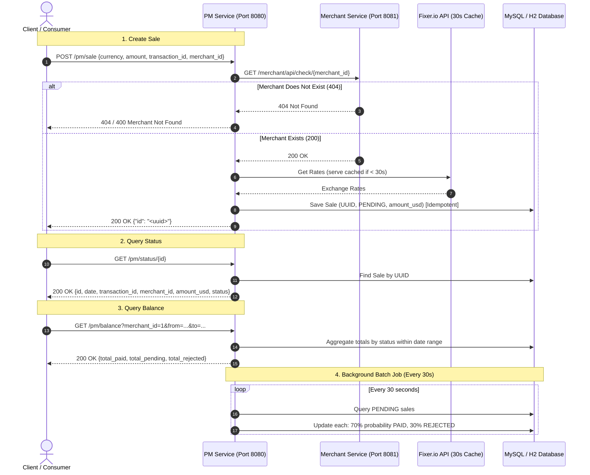

# Modernization & Completion Task Documentation

## 1. Overview & Business Goal
This document outlines the requirements, architectural specifications, technical constraints, gap analysis, and implementation roadmap for the Spring Boot Microservices Payment Gateway challenge.

The system consists of two decoupled microservices:
1. **`aserron-dlocal-merchant` (Port 8081)**: Merchant verification service.
2. **`aserron-dlocal-pm` (Port 8080)**: Payment Manager service handling transactions, currency conversion, idempotency, date-ranged balances, and automated background transaction processing.

---

## 2. Technical Constraints Checklist

| Constraint | Source Requirement | Status & Implementation Details |
| :--- | :--- | :--- |
| **Java 8 (1.8)** | `Requirements_ssr-test-20180518.docx` | Both modules configured with `<java.version>1.8</java.version>`. |
| **Spring Framework 5 / Spring Boot 2** | `Requirements_ssr-test-20180518.docx` | Uses Spring Boot 2.1.x with Spring 5.1. |
| **Jetty Embedded Server** | `Requirements_ssr-test-20180518.docx` | Tomcat excluded; `spring-boot-starter-jetty` included in both apps. |
| **MySQL 5.x / 8 Database** | `Requirements_ssr-test-20180518.docx` | MySQL schema with `merchants` and `sales` tables; UUID binary persistence. |
| **Merchant CHECK Endpoint** | `Requirements_ssr-test-20180518.docx` | `GET /merchant/api/check/{id}` -> 200 (Found) / 404 (Not Found). |
| **SALE Endpoint** | `Requirements_ssr-test-20180518.docx` | `POST /pm/sale` -> `{ "id": "<uuid>" }`. |
| **SALE Idempotency** | `Requirements_ssr-test-20180518.docx` | Idempotent on `(merchant_id, transaction_id)` tuple returning existing `id`. |
| **Fixer.io Currency Conversion** | `Requirements_ssr-test-20180518.docx` | Amount stored in USD converted using Fixer.io. |
| **Fixer.io 30-Second Limit** | `Requirements_ssr-test-20180518.docx` | Remote Fixer API called <= 1 time per 30s. Rate cache with 30s TTL. |
| **SALE Initial Status** | `Requirements_ssr-test-20180518.docx` | All created sales start with status `PENDING`. |
| **Merchant REST Validation** | `Requirements_ssr-test-20180518.docx` | PM validates `merchant_id` by calling Merchant CHECK REST endpoint. |
| **STATUS Endpoint** | `Requirements_ssr-test-20180518.docx` | `GET /pm/status/{id}` -> `{ id, date, transaction_id, merchant_id, amount_usd, status }`. |
| **BALANCE Endpoint** | `Requirements_ssr-test-20180518.docx` | `GET /pm/balance?merchant_id=...&from=...&to=...` -> `{ total_paid, total_pending, total_rejected }`. |
| **Batch Processing Job** | `Requirements_ssr-test-20180518.docx` | Scheduled every 30s. Transitions PENDING sales: 70% `PAID`, 30% `REJECTED`. |
| **Automated Tests** | `Requirements_ssr-test-20180518.docx` | Comprehensive unit/integration tests with in-memory H2 database profile. |

---

## 3. High-Level Architecture & Interaction Flow

