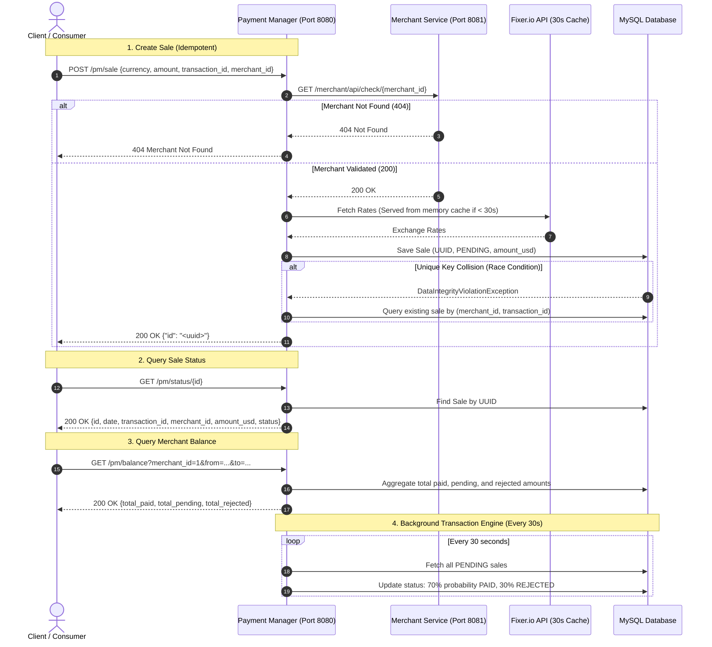

# DLocal Payment Gateway Microservices

[](https://www.oracle.com/java/)
[](https://spring.io/projects/spring-boot)
[](https://www.eclipse.org/jetty/)
[](https://www.mysql.com/)
[](https://www.docker.com/)

A distributed, resilient, and decoupled microservices payment gateway built with **Java 8**, **Spring Boot 2.1**, **Embedded Jetty**, and **MySQL 8**. The system acts as a high-throughput API gateway pattern handling asynchronous payment transaction ingestion, currency exchange triangulation with rate caching, strict database-level idempotency, date-ranged merchant balance aggregation, and automated background transaction processing.

---

## 🏛️ System Architecture

The architecture consists of two decoupled Spring Boot microservices backed by a shared MySQL database (or H2 for unit/integration testing):

1. **`aserron-dlocal-merchant` (Port 8081 | Context: `/merchant`)**:
   - Merchant directory and validation service.
   - Exposes REST endpoints to check merchant registration status and list merchants.
2. **`aserron-dlocal-pm` (Port 8080 | Context: `/`)**:
   - Payment Manager service handling transactions, currency conversion, idempotency, date-ranged balances, and automated background transaction processing.
   - Integrates with Fixer.io for real-time exchange rates with atomic 30-second TTL caching.
   - Executes a scheduled background worker every 30 seconds to transition `PENDING` transactions to `PAID` (70%) or `REJECTED` (30%).

### Transaction Lifecycle Flow



---

## 🚀 Key Technical Highlights & Resilience

### 1. Strict Idempotency & Concurrency Race Recovery
- **Database Uniqueness**: Guaranteed by a composite unique index `uk_sales_merchant_tx` on `(merchants_id, transaction_id)`.
- **Race Collision Recovery**: If concurrent requests attempt to register the exact same transaction simultaneously, the service catches `DataIntegrityViolationException` / duplicate key errors during `saveAndFlush` and gracefully falls back to returning the existing transaction ID.

### 2. Fixer.io Currency Triangulation & 30-Second TTL Cache
- **Rate Limit Compliance**: Fixer.io free tier is constrained to EUR base currency and rate limits. The service performs currency triangulation (`Amount / Rate(SRC) * Rate(USD)`) to persist all sales in normalized USD.
- **In-Memory Cache**: Fixer.io API calls are cached with a strict 30-second TTL window using `AtomicReference<FixerIORateResponse>`, guaranteeing zero excessive outbound API calls under high traffic.

### 3. High-Throughput UUID Strategy
- **Binary Persistence**: Transaction IDs are stored as 128-bit `BINARY(16)` primary keys in MySQL InnoDB to minimize index bloat and RAM consumption.
- **Clustered Index Architecture**: See [Docs/UUID_KNOWLEDGE.md](file:///e:/aserron/demo/spring-boot-microservices/Docs/UUID_KNOWLEDGE.md) for detailed performance analysis comparing UUIDv4 page fragmentation against sequential UUIDv7 monotonically increasing identifiers.

### 4. Automated 30-Second Batch Engine
- Managed by Spring's `@Scheduled(fixedRate = 30000)` scheduler in `TransactionJobService`.
- Continuously processes all `PENDING` transactions and pseudo-randomly transitions 70% to `PAID` and 30% to `REJECTED`.

### 5. Multi-Module Parent POM & OCI Containers
- Unified root reactor `pom.xml` managing compiler plugins, test memory parameters (`-Xms64m -Xmx256m`), JaCoCo coverage (`0.8.8`), and Google Jib containerization (`3.4.0`).
- Ready-to-run `docker-compose.yml` with automated container healthcheck dependencies.

---

## 📡 REST API Reference

### Merchant Service (`aserron-dlocal-merchant` | Port 8081)

#### 1. Check Merchant
- **Endpoint**: `GET /merchant/api/check/{id}`
- **Description**: Verifies if a merchant ID is registered.
- **Response**:
  - `200 OK`: Returns merchant object.
  - `404 Not Found`: Merchant does not exist.

```bash
curl -X GET http://localhost:8081/merchant/api/check/1
```

```json
{
  "id": 1,
  "name": "Merchant One"
}
```

#### 2. List All Merchants
- **Endpoint**: `GET /merchant/api/all`
- **Description**: Returns all registered merchants.

```bash
curl -X GET http://localhost:8081/merchant/api/all
```

---

### Payment Manager Service (`aserron-dlocal-pm` | Port 8080)

#### 1. Create Sale (Idempotent)
- **Endpoint**: `POST /pm/sale`
- **Description**: Creates a new transaction with status `PENDING` and calculates `amount_usd` via currency triangulation. Subsequent requests with identical `merchant_id` and `transaction_id` return the existing `id`.
- **Request Body**:
  - `currency` (String, required): ISO 3-letter currency code (e.g. `"USD"`, `"EUR"`, `"UYU"`).
  - `amount` (Decimal, required): Transaction amount (> 0).
  - `transaction_id` (Long, required): Merchant's unique transaction reference.
  - `merchant_id` (Long, required): Merchant identifier.

```bash
curl -X POST http://localhost:8080/pm/sale \
  -H "Content-Type: application/json" \
  -d '{
    "currency": "EUR",
    "amount": 100.50,
    "transaction_id": 987654,
    "merchant_id": 1
  }'
```

```json
{
  "id": "7f000001-83d3-1d42-8183-d39b360b0000"
}
```

#### 2. Get Transaction Status
- **Endpoint**: `GET /pm/status/{id}`
- **Description**: Retrieves transaction details by its 36-character UUID string.

```bash
curl -X GET http://localhost:8080/pm/status/7f000001-83d3-1d42-8183-d39b360b0000
```

```json
{
  "id": "7f000001-83d3-1d42-8183-d39b360b0000",
  "date": "2026-08-19 08:00:00",
  "merchant_id": "1",
  "transaction_id": "987654",
  "amount_usd": 109.25,
  "status": "PENDING"
}
```

#### 3. Query Merchant Balance (Query Params)
- **Endpoint**: `GET /pm/balance?merchant_id={id}&from={isoDate}&to={isoDate}`
- **Description**: Calculates cumulative totals in USD across transaction statuses within an optional date range.

```bash
curl -X GET "http://localhost:8080/pm/balance?merchant_id=1&from=2026-01-01T00:00:00&to=2026-12-31T23:59:59"
```

```json
{
  "total_paid": 5420.00,
  "total_pending": 109.25,
  "total_rejected": 350.00
}
```

#### 4. Query Merchant Balance (Path Param)
- **Endpoint**: `GET /pm/balance/{merchant_id}`
- **Description**: Calculates lifetime balance totals in USD for a merchant.

```bash
curl -X GET http://localhost:8080/pm/balance/1
```

#### 5. List All Transactions
- **Endpoint**: `GET /pm/all/status`
- **Description**: Lists all recorded sales in the system.

```bash
curl -X GET http://localhost:8080/pm/all/status
```

---

### Actuator & Health Check Endpoints

| Service | Endpoint | Purpose |
| :--- | :--- | :--- |
| **Merchant Service** | `GET http://localhost:8081/merchant/actuator/health` | Container liveness/readiness probe |
| **Merchant Service** | `GET http://localhost:8081/merchant/actuator/info` | Application metadata |
| **PM Service** | `GET http://localhost:8080/pm/actuator/health` | Container liveness/readiness probe |
| **PM Service** | `GET http://localhost:8080/pm/actuator/info` | Application metadata |

---

## 🗄️ Database Schema

The database schema is initialized from [SQL CREATE/create_schema.sql](file:///e:/aserron/demo/spring-boot-microservices/SQL%20CREATE/create_schema.sql):

```sql
-- Merchants table
CREATE TABLE `merchants` (
  `id` INT(10) UNSIGNED NOT NULL AUTO_INCREMENT,
  `name` VARCHAR(45) NOT NULL DEFAULT 'NO NAME',
  PRIMARY KEY (`id`)
) ENGINE=InnoDB DEFAULT CHARSET=utf8;

-- Sales table with UUID Binary(16) & composite uniqueness
CREATE TABLE `sales` (
  `id` BINARY(16) NOT NULL COMMENT 'UUID identifier',
  `merchants_id` INT(10) UNSIGNED NOT NULL,
  `currency` VARCHAR(3) NOT NULL DEFAULT 'USD',
  `amount_org` DOUBLE(10,2) NOT NULL DEFAULT 0,
  `amount_usd` DECIMAL(10,2) NOT NULL DEFAULT 0,
  `status` ENUM('PENDING','PAID','REJECTED') NOT NULL DEFAULT 'PENDING',
  `created` DATETIME NOT NULL DEFAULT CURRENT_TIMESTAMP,
  `transaction_id` INT(10) NULL,
  PRIMARY KEY (`id`),
  CONSTRAINT `fk_sales_merchants1` FOREIGN KEY (`merchants_id`) REFERENCES `merchants` (`id`) ON DELETE CASCADE,
  UNIQUE INDEX `uk_sales_merchant_tx` (`merchants_id` ASC, `transaction_id` ASC)
) ENGINE=InnoDB DEFAULT CHARSET=utf8;
```

---

## 🛠️ Prerequisites & Stack

- **Java Runtime / JDK**: OpenJDK 8 (Java 1.8)
- **Build Tool**: Apache Maven 3.6+ (or included `./mvnw` wrapper)
- **Database**: MySQL 8.0+
- **Containers**: Docker 20.10+ & Docker Compose v2+

---

## 🚦 Getting Started

### Option 1: Run with Docker Compose (Recommended)

Start MySQL, Merchant Service, and PM Service in a single command with automated health checks and dependencies:

```bash
docker compose up --build
```

To run in detached mode:
```bash
docker compose up -d
```

To tear down containers and volumes:
```bash
docker compose down -v
```

---

### Option 2: Run with Maven Locally

#### 1. Start MySQL Database
Ensure a local MySQL instance is running on `localhost:3306` with schema `dlocal_demo_db` and credentials `dlocal_user`/`dlocal_pass`, or execute the schema script:
```bash
mysql -u root -p < "SQL CREATE/create_schema.sql"
```

#### 2. Build Entire Reactor
```bash
# Windows
.\mvnw.cmd clean package -DskipTests

# Linux / macOS
./mvnw clean package -DskipTests
```

#### 3. Run Microservices

**Terminal 1 (Merchant Service):**
```bash
# Windows
.\mvnw.cmd -pl aserron-dlocal-merchant spring-boot:run

# Linux / macOS
./mvnw -pl aserron-dlocal-merchant spring-boot:run
```

**Terminal 2 (Payment Manager Service):**
```bash
# Windows
.\mvnw.cmd -pl aserron-dlocal-pm spring-boot:run

# Linux / macOS
./mvnw -pl aserron-dlocal-pm spring-boot:run
```

---

### Option 3: Quick Start Batch Script (Windows)

A legacy helper script [run-merch.bat](file:///e:/aserron/demo/spring-boot-microservices/run-merch.bat) is provided to spawn both services in parallel PowerShell windows:
```cmd
run-merch.bat
```

---

## 🧪 Testing & Code Quality

The project includes unit tests, BDD Mockito service tests, multi-threaded concurrency race tests, and repository tests running on an in-memory H2 database profile.

### Running Test Suite
```bash
# Run all tests across modules with bounded memory settings
.\mvnw.cmd test
```

### Coverage & Test Highlights
- **FX Rate Triangulation & Caching**: Tests verify 30-second TTL limits and cross-currency triangulation.
- **Concurrent Race Conditions**: Multi-threaded tests verify concurrent requests for identical `(merchant_id, transaction_id)` execute collision recovery without failing.
- **JaCoCo Coverage**: Code coverage reports are automatically generated in `target/site/jacoco/index.html`.

---

## 📁 Project Structure

```
spring-boot-microservices/
├── pom.xml                               # Root parent POM aggregator
├── mvnw / mvnw.cmd                       # Maven wrapper executables
├── docker-compose.yml                    # Multi-container orchestration & healthchecks
├── run-merch.bat                         # Windows parallel launch script
├── SQL CREATE/
│   └── create_schema.sql                 # MySQL schema & seed data
├── Docs/
│   ├── UUID_KNOWLEDGE.md                 # UUIDv4 vs UUIDv7 clustered indexing knowledge base
│   ├── specs.md                          # Technical specifications and architectural analysis
│   └── task-modernization/               # Task documentation and commit conventions
├── aserron-dlocal-merchant/              # Merchant verification microservice (Port 8081)
│   ├── pom.xml
│   └── src/
│       ├── main/java/aserron/dlocal/merchant/
│       │   ├── MerchantRestApplication.java
│       │   ├── domain/Merchant.java
│       │   └── rest/MerchantController.java
│       └── main/resources/application.properties
└── aserron-dlocal-pm/                    # Payment Manager microservice (Port 8080)
    ├── pom.xml
    └── src/
        ├── main/java/aserron/dlocal/demo/pm/
        │   ├── PaymentApplication.java
        │   ├── consumer/FixerIOService.java
        │   ├── data/service/SaleServiceImpl.java
        │   ├── data/service/TransactionJobService.java
        │   └── rest/controllers/ManagerController.java
        └── main/resources/application.properties
```

---

## 📚 Further Documentation

- **UUID Strategy & InnoDB B+ Tree Analysis**: [Docs/UUID_KNOWLEDGE.md](file:///e:/aserron/demo/spring-boot-microservices/Docs/UUID_KNOWLEDGE.md)
- **Technical Specifications & Flow Details**: [Docs/specs.md](file:///e:/aserron/demo/spring-boot-microservices/Docs/specs.md)
- **Modernization Task Assessment**: [Docs/task-modernization/TASK_ASSESSMENT_AND_SPECIFICATIONS.md](file:///e:/aserron/demo/spring-boot-microservices/Docs/task-modernization/TASK_ASSESSMENT_AND_SPECIFICATIONS.md)
- **Commit Conventions**: [Docs/task-modernization/COMMIT_CONVENTIONS.md](file:///e:/aserron/demo/spring-boot-microservices/Docs/task-modernization/COMMIT_CONVENTIONS.md)
