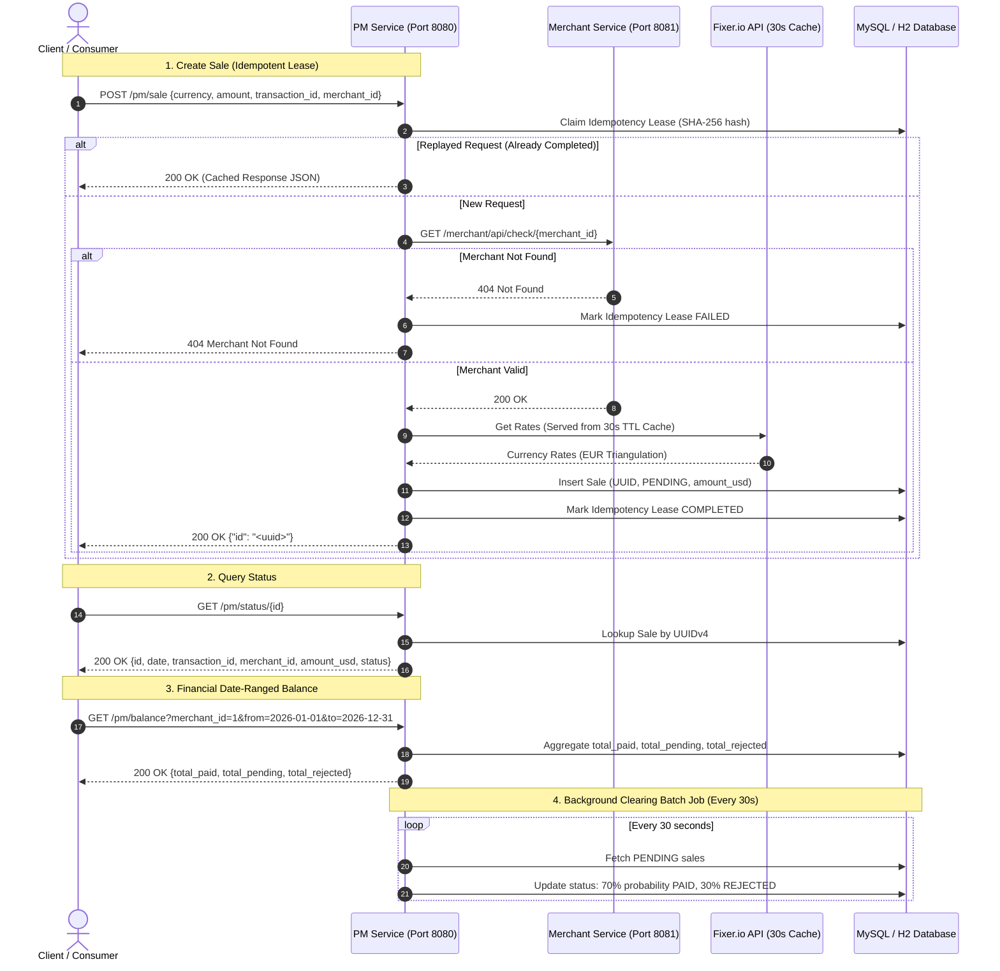

# Spring Boot Microservices — Payment Gateway Demo


A decoupled, high-performance payment gateway demo built with **Java 8**, **Spring Boot 2 / Spring 5**, and embedded **Jetty**. The platform implements robust financial transaction processing, real-time currency conversion with rate-limit protection, date-ranged balances, an automated background clearing engine, and an enterprise-grade **SHA-256 Idempotency Engine** with concurrent race-condition resolution.

---

## 📑 Table of Contents
- [Architecture Overview](#-architecture-overview)
- [System Interaction Flow](#-system-interaction-flow)
- [Core Engineering Highlights](#-core-engineering-highlights)
- [REST API Specification](#-rest-api-specification)
- [Project Structure](#-project-structure)
- [Getting Started](#-getting-started)
  - [Prerequisites](#prerequisites)
  - [Option 1: Docker Compose (Recommended)](#option-1-docker-compose-recommended)
  - [Option 2: Local Development with Maven Wrapper](#option-2-local-development-with-maven-wrapper)
- [Testing & Quality Assurance](#-testing--quality-assurance)
- [Architecture Decision Records & Documentation](#-architecture-decision-records--documentation)

---

## 🏛️ Architecture Overview

The system is structured as a Maven multi-module aggregator comprising two decoupled microservices and a shared persistence layer:

```
                  ┌─────────────────────────────────────────┐
                  │           Client / Gateway API          │
                  └──────┬───────────────────────────┬──────┘
                         │                           │
                         │ POST /pm/sale             │ GET /merchant/api/check/{id}
                         ▼                           ▼
        ┌──────────────────────────────────┐   ┌──────────────────────────────────┐
        │  Payment Manager (PM) Service    │   │         Merchant Service         │
        │  (aserron-dlocal-pm :8080)       │   │  (aserron-dlocal-merchant :8081) │
        └───────┬──────────────┬───────────┘   └─────────────────┬────────────────┘
                │              │                                 │
                │ Inter-svc    │ Fixer.io FX API                 │
                │ Verification │ (30s TTL Cache)                 │
                └──────────────┼─────────────────────────────────┘
                               ▼
        ┌─────────────────────────────────────────────────────────┐
        │             MySQL 8 / In-Memory H2 Database             │
        │    - merchants (Merchant Directory)                     │
        │    - sales (Binary(16) UUID Transactions)               │
        │    - idempotency_records (SHA-256 Leases & Replays)     │
        └─────────────────────────────────────────────────────────┘
```

1. **[`aserron-dlocal-merchant`](./aserron-dlocal-merchant)** (Port `8081`):
   - Merchant registry and validation service.
   - Provides verification endpoints to validate merchant existence prior to transaction creation.

2. **[`aserron-dlocal-pm`](./aserron-dlocal-pm)** (Port `8080`):
   - Core Payment Manager gateway orchestrator.
   - Handles sale intake, external currency conversion (Fixer.io), idempotency leasing, status queries, date-ranged balances, and scheduled background transaction clearing.

---

## 🔄 System Interaction Flow



---

## ⚡ Core Engineering Highlights

### 1. Enterprise Idempotency Record Engine
- **Unique Constraint Invariant:** Database index on `(client_id, operation_name, idempotency_key)` preventing duplicate inserts.
- **SHA-256 Payload Fingerprinting:** Canonical request body hashing (`merchant_id:transaction_id:currency:amount`). Detects parameter tampering or key re-use with altered payloads, rejecting immediately with **`422 Unprocessable Entity`**.
- **Transaction Isolation & Micro-Race Resolution:** Lease claims execute in isolated `REQUIRES_NEW` transactions via `TransactionTemplate`. Concurrent duplicate threads wait on in-flight leases and return the identical cached result with **`200 OK`**, avoiding duplicate processing and constraint rollback errors.
- **Automated TTL Purge:** Scheduled cleanup (`IdempotencyCleanupJob`) safely purges expired completed records without locking active transactions.

### 2. Binary(16) UUID Persistence
- High-performance 16-byte binary storage for UUIDv4 primary keys in MySQL, preventing string indexing overhead and table bloat.

### 3. Rate-Limit Resilient FX Caching (Fixer.io)
- Enforces external API rate limits (maximum 1 call per 30 seconds) through an in-memory TTL rate cache with EUR triangulation for non-base currencies.

### 4. Background Transaction Clearing Job
- Automated scheduled daemon (`TransactionJobService`) executing every 30 seconds to transition `PENDING` transactions to final states (`70% PAID`, `30% REJECTED`).

---

## 📡 REST API Specification

### 1. Merchant Verification (`aserron-dlocal-merchant`)

#### `GET /merchant/api/check/{id}`
Verifies whether a merchant exists.

- **Path Parameter:** `id` (Long) — Merchant Identifier.
- **Responses:**
  - `200 OK`: `{"id": 1, "name": "Merchant Name"}`
  - `404 Not Found`: Merchant does not exist.

---

### 2. Payment Gateway Manager (`aserron-dlocal-pm`)

#### `POST /pm/sale`
Creates a new sale transaction. Converts amount to USD and stores transaction in `PENDING` state.

- **Headers (Optional):** `Idempotency-Key: <unique-client-key>` *(Defaults to `merchant_{merchant_id}:tx_{transaction_id}`)*
- **Request Body:**
  ```json
  {
    "currency": "EUR",
    "amount": 100.00,
    "transaction_id": 501,
    "merchant_id": 1
  }
  ```
- **Responses:**
  - `200 OK`: `{"id": "b31b4990-1234-4567-89ab-cdef01234567"}`
  - `404 Not Found`: `{"status": "NOT_FOUND", "error_code": "MERCHANT_NOT_FOUND", "message": "Merchant ID [999] was not found"}`
  - `409 Conflict`: `{"status": "CONFLICT", "error_code": "CONFLICT", "message": "Request currently in progress"}`
  - `422 Unprocessable Entity`: `{"status": "UNPROCESSABLE_ENTITY", "error_code": "UNPROCESSABLE_ENTITY", "message": "Idempotency payload fingerprint mismatch"}`

---

#### `GET /pm/status/{id}`
Retrieves transaction metadata and current processing status by UUID.

- **Path Parameter:** `id` (UUID string) — Sale UUID.
- **Response `200 OK`:**
  ```json
  {
    "id": "b31b4990-1234-4567-89ab-cdef01234567",
    "date": "2026-08-19 10:00:00",
    "transaction_id": 501,
    "merchant_id": 1,
    "amount_usd": 115.50,
    "status": "PAID"
  }
  ```

---

#### `GET /pm/balance`
Aggregates total amounts across `PAID`, `PENDING`, and `REJECTED` states for a given merchant within a date range.

- **Query Parameters:**
  - `merchant_id` (Long, Required)
  - `from` (Date: `yyyy-MM-dd` or `yyyy-MM-dd HH:mm:ss`, Required)
  - `to` (Date: `yyyy-MM-dd` or `yyyy-MM-dd HH:mm:ss`, Required)
- **Response `200 OK`:**
  ```json
  {
    "total_paid": 1550.75,
    "total_pending": 300.00,
    "total_rejected": 150.25
  }
  ```

---

## 📁 Project Structure

```
spring-boot-microservices/
├── pom.xml                               # Root Multi-Module Maven Aggregator
├── docker-compose.yml                    # Container orchestration (MySQL + Services)
├── mvnw / mvnw.cmd                       # Maven Wrapper (v3.8+)
├── run-merch.bat                         # Windows PowerShell startup helper
├── SQL CREATE/
│   └── create_schema.sql                 # MySQL DDL (merchants, sales, idempotency_records)
├── Docs/
│   ├── Requirements_ssr-test-20180518.md # Challenge specifications & requirements
│   ├── IDEMPOTENCY_ARCHITECTURE_DECISION.md # Architecture Decision Record (ADR)
│   ├── feats/
│   │   └── UUID_KNOWLEDGE.md             # Binary(16) UUID persistence design
│   └── task-modernization/
│       ├── TASK_ASSESSMENT_AND_SPECIFICATIONS.md
│       └── COMMIT_CONVENTIONS.md
├── aserron-dlocal-merchant/              # Merchant Microservice (Port 8081)
│   ├── pom.xml
│   └── src/main/java/aserron/dlocal/demo/merchant/
└── aserron-dlocal-pm/                    # Payment Manager Microservice (Port 8080)
    ├── pom.xml
    └── src/main/java/aserron/dlocal/demo/pm/
```

---

## 🚀 Getting Started

### Prerequisites
- **Java JDK 8 (1.8)**
- **Maven 3.6+** (or use included `./mvnw` / `.\mvnw.cmd`)
- **Docker & Docker Compose** (Optional, for containerized execution)
- **MySQL 8.0+** (if running locally without Docker)

---

### Option 1: Docker Compose (Recommended)

Start the entire environment (MySQL 8, Merchant Service, and PM Service) with one command:

```bash
docker-compose up -d
```

Check health status:
```bash
docker-compose ps
```

---

### Option 2: Local Development with Maven Wrapper

1. **Start MySQL & Initialize Schema:**
   Ensure MySQL is running on `localhost:3306` with database `dlocal_demo_db`, or execute the schema script:
   ```bash
   mysql -u root -p < "SQL CREATE/create_schema.sql"
   ```

2. **Build and Verify All Modules:**
   ```powershell
   .\mvnw.cmd clean test-compile
   ```

3. **Start Microservices:**
   - **Terminal 1 (Merchant Service - Port 8081):**
     ```powershell
     .\mvnw.cmd spring-boot:run -pl aserron-dlocal-merchant
     ```
   - **Terminal 2 (Payment Manager Service - Port 8080):**
     ```powershell
     .\mvnw.cmd spring-boot:run -pl aserron-dlocal-pm
     ```

---

## 🧪 Testing & Quality Assurance

The codebase includes an extensive **TDD / BDD** test suite leveraging MockMvc, in-memory H2 database profiles, Mockito, and multi-threaded concurrency executors:

```powershell
# Run all unit & integration tests across both microservices
.\mvnw.cmd test
```

### Key Integration Test Scenarios:
- **`ManagerControllerIntegrationTest`**:
  - `createSaleSuccess`: Validates currency conversion, merchant verification, and initial `PENDING` state.
  - `createSaleConcurrentRaceCondition`: Launches **10 concurrent threads** simultaneously; verifies atomic lease resolution, duplicate suppression, and exact single database record creation.
  - `checkStatusAndBalance`: Verifies date-range parsing, status queries, and financial balance aggregation.
  - `scheduledBatchClearing`: Tests 30-second clearing job and 70/30 state distribution.
- **`IdempotencyRecordIntegrationTest`**:
  - `createSaleWithIdempotencyKeyReplay`: Validates response caching and instant replays.
  - `createSaleWithPayloadMismatchReturns422`: Reused keys with modified amounts trigger `422 Unprocessable Entity`.
  - `createSaleInFlightConflictReturns409`: In-flight active locks return `409 Conflict` with `Retry-After: 1`.
  - `scheduledCleanupPurgesExpiredCompletedRecords`: Validates automated TTL cleanup job.

---

## 📚 Architecture Decision Records & Documentation

For in-depth architectural details, refer to the documentation directory:
- 📖 [**Requirements Specification**](file:///e:/aserron/demo/spring-boot-microservices/Docs/Requirements_ssr-test-20180518.md)
- 📐 [**Idempotency Architecture Decision Record (ADR)**](file:///e:/aserron/demo/spring-boot-microservices/Docs/IDEMPOTENCY_ARCHITECTURE_DECISION.md)
- 🔑 [**UUID Persistence & Binary(16) Strategy**](file:///e:/aserron/demo/spring-boot-microservices/Docs/feats/UUID_KNOWLEDGE.md)
- 📋 [**Task Assessment & Modernization Roadmap**](file:///e:/aserron/demo/spring-boot-microservices/Docs/task-modernization/TASK_ASSESSMENT_AND_SPECIFICATIONS.md)
- ✍️ [**Conventional Commits Specification**](file:///e:/aserron/demo/spring-boot-microservices/Docs/task-modernization/COMMIT_CONVENTIONS.md)

